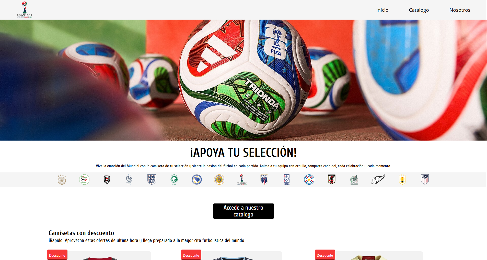

# ⚽ Camisetas Mundial 2026

Página web de venta de camisetas de selecciones para el Mundial 2026 (Estados Unidos, México y Canadá). Proyecto final de la asignatura **Lenguaje de Marcas y Sistemas de Gestión de Información** del primer curso.

🔗 **Demo online:** proyectofinalprimercurso.netlify.app

## 📌 Descripción

Tienda online ficticia donde se pueden consultar las camisetas de distintas selecciones. El objetivo del proyecto era aplicar lenguajes de marcado para estructurar, dar estilo y organizar la información de un sitio web completo.

## ✨ Características

- Diseño **responsive**: se adapta a móvil, tablet y escritorio.
- Catálogo de camisetas.
- Menú de navegación común a todas las páginas.
- Formulario de contacto.
- Código HTML semántico y validado.

## 🛠️ Tecnologías utilizadas

- **HTML5**: estructura y etiquetas semánticas
- **CSS3**: estilos, Flexbox y Grid, media queries
- [**JavaScript**: Para animaciones e interactividad]
